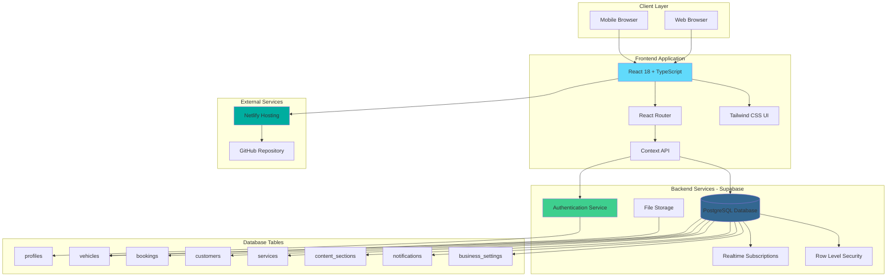
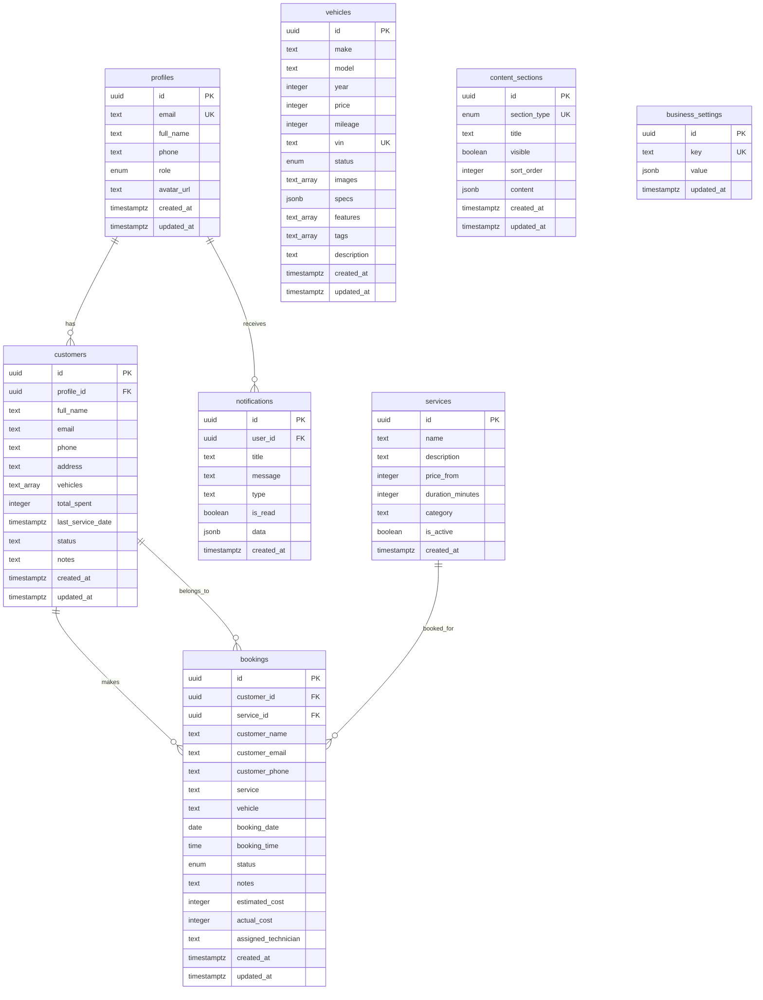
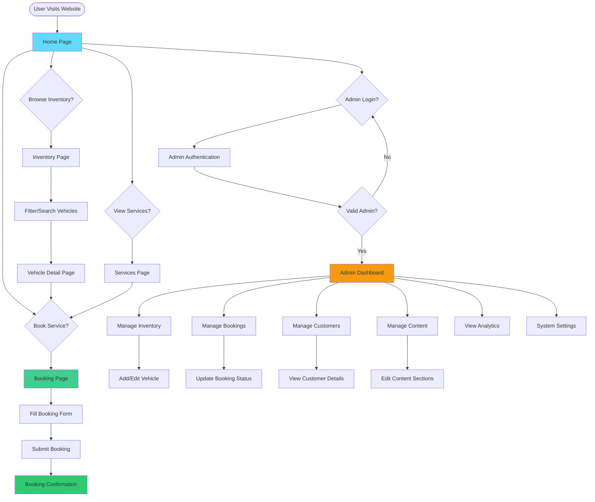
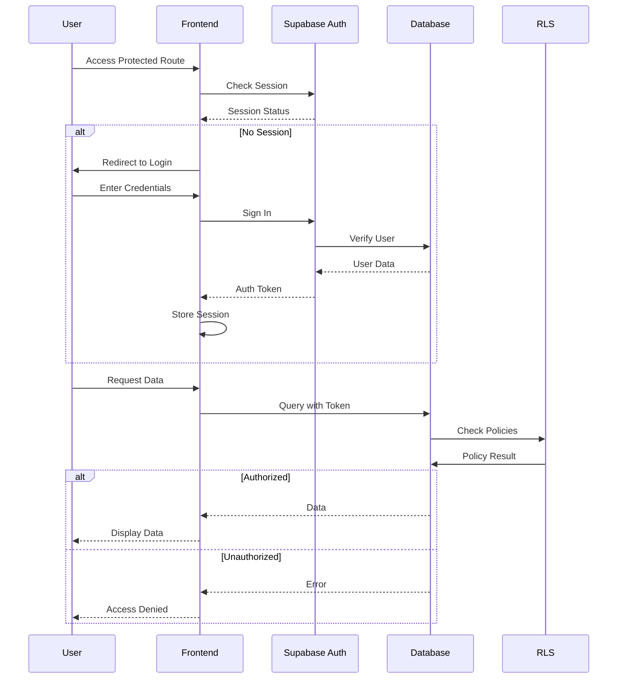
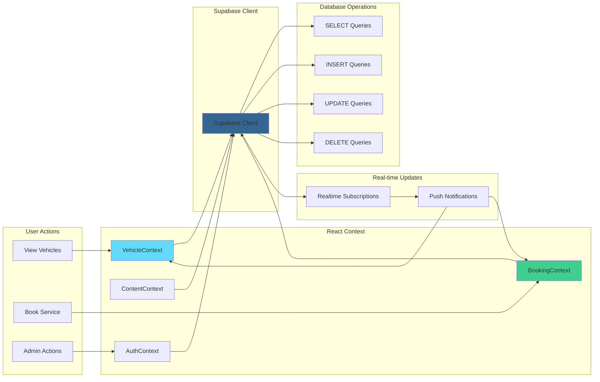
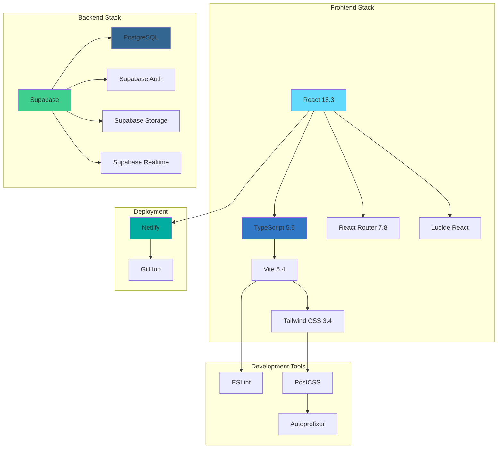
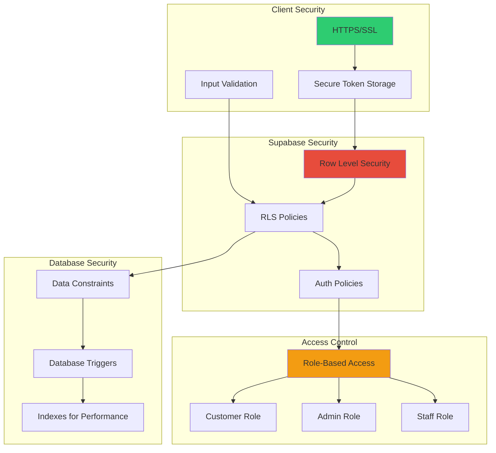

# System Architecture & Design Diagrams

This document contains comprehensive system design diagrams for the Auto Hub Dealership platform.

## 📐 System Architecture Diagram



## 🗄️ Database Schema Diagram (ERD)



## 🧩 Component Architecture Diagram



```mermaid
graph TD
    subgraph "App.tsx - Root Component"
        Router[React Router]
        ErrorBoundary[Error Boundary]
    end

    subgraph "Context Providers"
        AuthProvider[AuthContext]
        VehicleProvider[VehicleContext]
        BookingProvider[BookingContext]
        ContentProvider[ContentContext]
    end

    subgraph "Layout Components"
        Header[Header]
        Footer[Footer]
    end

    subgraph "Page Components"
        HomePage[HomePage]
        InventoryPage[InventoryPage]
        ServicesPage[ServicesPage]
        BookingPage[BookingPage]
        VehicleDetailPage[VehicleDetailPage]
        AdminPage[AdminPage]
        ContactPage[ContactPage]
        RepairStatusPage[RepairStatusPage]
    end

    subgraph "Home Page Components"
        HeroSection[HeroSection]
        QuickActions[QuickActions]
        NewArrivals[NewArrivals]
        ServicesPreview[ServicesPreview]
        FinanceSection[FinanceSection]
        TrustSection[TrustSection]
        PromoSection[PromoSection]
        MapSection[MapSection]
        RepairStatusWidget[RepairStatusWidget]
    end

    subgraph "Admin Components"
        AdminDashboard[AdminDashboard]
        InventoryManager[InventoryManager]
        BookingManager[BookingManager]
        CustomerManager[CustomerManager]
        ContentManager[ContentManager]
        AnalyticsDashboard[AnalyticsDashboard]
        SystemSettings[SystemSettings]
    end

    subgraph "UI Components"
        VehicleCard[VehicleCard]
        Modal[Modal]
        Toast[Toast]
        LoadingSpinner[LoadingSpinner]
        Car3D[Car3D]
        FormValidation[FormValidation]
    end

    subgraph "Auth Components"
        AdminLogin[AdminLogin]
        ProtectedRoute[ProtectedRoute]
    end

    Router --> HomePage
    Router --> InventoryPage
    Router --> ServicesPage
    Router --> BookingPage
    Router --> VehicleDetailPage
    Router --> AdminPage
    Router --> ContactPage
    Router --> RepairStatusPage

    HomePage --> HeroSection
    HomePage --> QuickActions
    HomePage --> NewArrivals
    HomePage --> ServicesPreview
    HomePage --> FinanceSection
    HomePage --> TrustSection
    HomePage --> PromoSection
    HomePage --> MapSection
    HomePage --> RepairStatusWidget

    AdminPage --> AdminDashboard
    AdminPage --> InventoryManager
    AdminPage --> BookingManager
    AdminPage --> CustomerManager
    AdminPage --> ContentManager
    AdminPage --> AnalyticsDashboard
    AdminPage --> SystemSettings
    AdminPage --> ProtectedRoute
    ProtectedRoute --> AdminLogin

    InventoryPage --> VehicleCard
    VehicleDetailPage --> VehicleCard
    VehicleDetailPage --> Car3D

    AuthProvider --> AdminPage
    VehicleProvider --> InventoryPage
    BookingProvider --> BookingPage
    ContentProvider --> HomePage

    style HomePage fill:#61dafb
    style AdminPage fill:#f39c12
    style AuthProvider fill:#3ecf8e
```

## 🔄 User Flow Diagram



## 🔐 Authentication & Authorization Flow



## 📊 Data Flow Diagram



## 🛠️ Technology Stack Diagram



## 📱 Page Structure & Routing

```mermaid
graph LR
    App[App.tsx] --> Routes[Routes]

    Routes --> Home[/ - HomePage]
    Routes --> Inventory[/inventory - InventoryPage]
    Routes --> Services[/services - ServicesPage]
    Routes --> Vehicle[/vehicle/:id - VehicleDetailPage]
    Routes --> Book[/book - BookingPage]
    Routes --> Repair[/repair-status - RepairStatusPage]
    Routes --> Contact[/contact - ContactPage]
    Routes --> Admin[/admin - AdminPage]

    Home --> Hero[Hero Section]
    Home --> NewArrivals[New Arrivals]
    Home --> ServicesPreview[Services Preview]
    Home --> Finance[Finance Section]
    Home --> Trust[Trust Section]
    Home --> Promo[Promo Section]
    Home --> Map[Map Section]

    Inventory --> VehicleList[Vehicle List]
    Inventory --> Filters[Filters & Search]

    Vehicle --> Details[Vehicle Details]
    Vehicle --> Car3D[3D Car View]
    Vehicle --> Specs[Specifications]

    Admin --> Dashboard[Admin Dashboard]
    Admin --> InventoryMgr[Inventory Manager]
    Admin --> BookingMgr[Booking Manager]
    Admin --> CustomerMgr[Customer Manager]
    Admin --> ContentMgr[Content Manager]
    Admin --> Analytics[Analytics]
    Admin --> Settings[System Settings]

    style Home fill:#61dafb
    style Admin fill:#f39c12
    style Vehicle fill:#e74c3c
```

## 🔒 Security Architecture



---

## 📝 Diagram Notes

### System Architecture

- **Frontend**: React SPA deployed on Netlify
- **Backend**: Supabase (BaaS) providing database, auth, storage, and realtime
- **Database**: PostgreSQL with Row Level Security
- **Deployment**: Continuous deployment via GitHub → Netlify

### Database Schema

- **8 main tables** with proper relationships
- **Foreign key constraints** for data integrity
- **Enums** for status fields (booking_status, vehicle_status, user_role)
- **JSONB fields** for flexible data storage (specs, content)
- **Array fields** for multi-value data (images, features, tags)

### Component Architecture

- **Context-based state management** (no Redux needed)
- **Protected routes** for admin access
- **Reusable UI components** for consistency
- **Error boundaries** for graceful error handling

### User Flows

- **Public users**: Browse inventory, view services, book appointments
- **Admin users**: Full CRUD operations on all entities
- **Real-time updates**: Live notifications and data sync

### Security

- **Row Level Security (RLS)** on all tables
- **Role-based access control** (customer, admin, staff)
- **Secure token management** via Supabase Auth
- **Input validation** on both client and server

---

_Last Updated: 2024_
